<h1 align="center">MikroTik Router on a Stick Lab (VMware + GNS3 VM)</h1>

<p align="center">
  
  
  
  
  
  <a href="https://github.com/JakubGawron/mikrotik-lab-inf.02/releases/latest"></a>
  
  
  
  
  
</p>

<p align="center">
  <a href="./README.pl.md">Polska dokumentacja</a>
</p>

<p align="center">
  VMware-based network lab using GNS3 VM for MikroTik practice and Polish INF.02 exam preparation, but not limited to it: routing, VLANs, DHCP, firewall rules, and router on a stick setup. Based on a similar lab used in 2024 lectures for around 200 people, teaching MikroTik as a Layer 3 device for the exam.
</p>

---

## Overview

A MikroTik CHR routes between four VLANs over a single tagged link to a GNS3 switch (router-on-a-stick). It also provides DHCP, DNS forwarding, NAT and firewall filtering. Four VPCS hosts are used for testing.

**Practice topics:** VLANs and 802.1Q, access vs. tagged ports, inter-VLAN routing, DHCP, DNS, NAT, firewall filter rules, interface lists, connectivity testing, basic RouterOS administration.

---

## Setup

### 1. Download

Get the latest lab files from [**Releases**](https://github.com/JakubGawron/mikrotik-lab-inf.02/releases/latest).

### 2. VMware

1. Install VMware Workstation.
2. Open **Edit → Virtual Network Editor → Change Settings** and set:
    - `VMnet1`: Host-only, `172.16.0.0/24`, DHCP off
    - `VMnet8`: NAT, `192.168.100.0`, DHCP off

### 3. GNS3 VM

1. Import the downloaded GNS3 VM `.ova` with **File → Open**.
2. Power on the VM.
3. Open the web interface of GNS3 VM Lab: **http://172.16.0.2**

---

## Topology

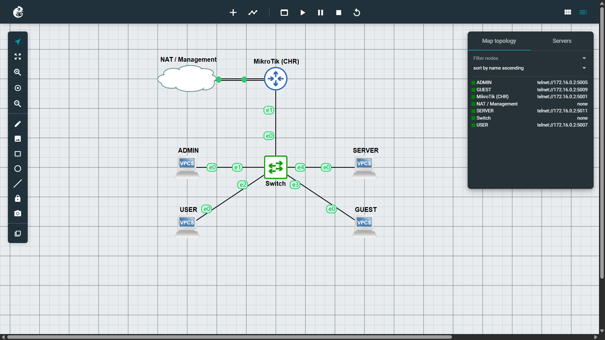

### Router Addressing and VLANs

| VLAN | Name             | Host   | Switch port | MikroTik interface | Network            | Gateway         | Host IP         |
| ---- | ---------------- | ------ | ----------- | ------------------ | ------------------ | --------------- | --------------- |
| 10   | ADMIN            | ADMIN  | 1 (access)  | `vlan10-admins`    | `10.10.0.0/24`     | `10.10.0.1`     | `10.10.0.2`     |
| 20   | USER             | USER   | 2 (access)  | `vlan20-users`     | `10.20.0.0/24`     | `10.20.0.1`     | `10.20.0.2`     |
| 30   | GUEST            | GUEST  | 3 (access)  | `vlan30-guests`    | `10.30.0.0/24`     | `10.30.0.1`     | `10.30.0.2`     |
| 40   | SERVER           | SERVER | 4 (access)  | `vlan40-servers`   | `10.40.0.0/24`     | `10.40.0.1`     | `10.40.0.2`     |
| –    | Management       | –      | –           | `management`       | `172.16.0.0/24`    | –               | `172.16.0.3`    |
| –    | WAN (VMware NAT) | –      | –           | `ether1`           | `192.168.100.0/24` | `192.168.100.2` | `192.168.100.3` |

---

## GNS3 Switch

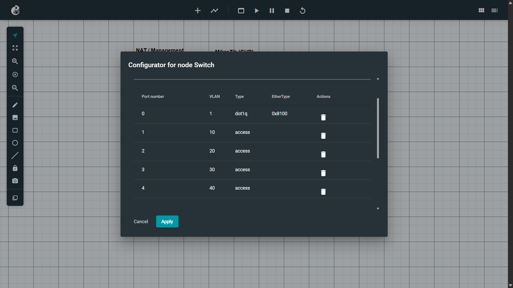

| Port | VLAN | Type                        | Connected to             |
| ---- | ---- | --------------------------- | ------------------------ |
| 0    | 1    | `dot1q`, EtherType `0x8100` | MikroTik (tagged uplink) |
| 1    | 10   | access                      | ADMIN                    |
| 2    | 20   | access                      | USER                     |
| 3    | 30   | access                      | GUEST                    |
| 4    | 40   | access                      | SERVER                   |

Access ports send frames untagged to the host; the tagged uplink carries all VLANs with 802.1Q tags. VLAN `1` on port `0` is not assumed to be a native VLAN.

## Router on a Stick

```text
ADMIN (VLAN 10) → switch access port 1 → tagged uplink (port 0)
  → MikroTik vlan10-admins → routing + firewall (rule 16)
  → vlan20-users → tagged uplink → access port 2 → USER (VLAN 20)
```

Each VLAN has its own logical interface on the router's single physical port, and that interface's `.1` address is the hosts' gateway.

---

## MikroTik Configuration

RouterOS v7 WebFig. `MikroTik CHR 7.24.4`

### IP Addresses

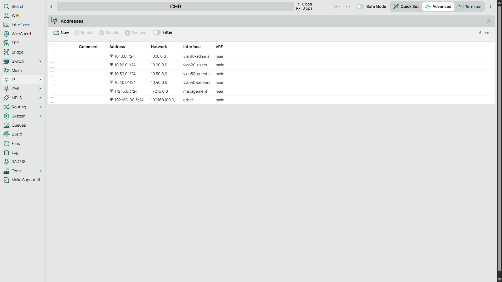

### VLAN Interfaces

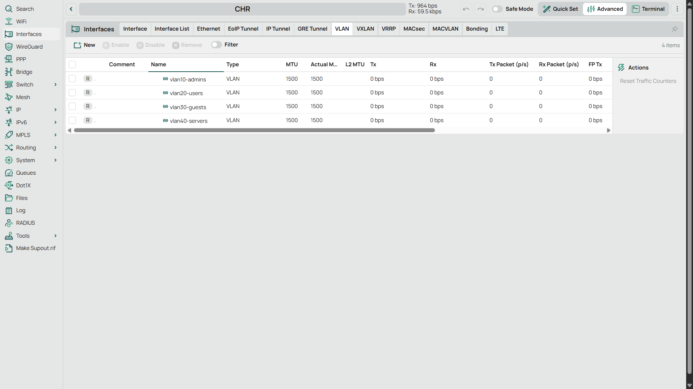

VLAN interfaces are nested under `ether2` in the interface tree. VLAN ID and parent columns are not visible here.

### Interfaces

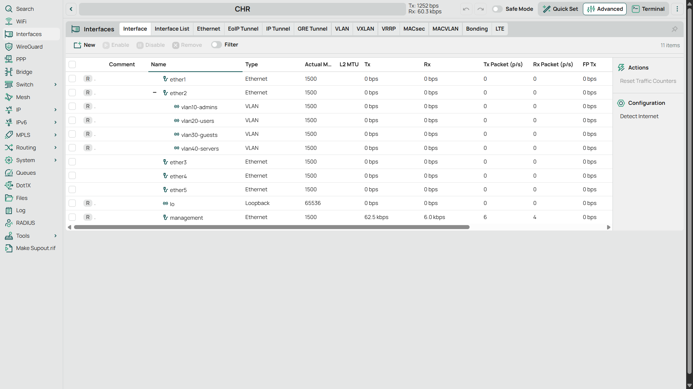

### Interface Lists

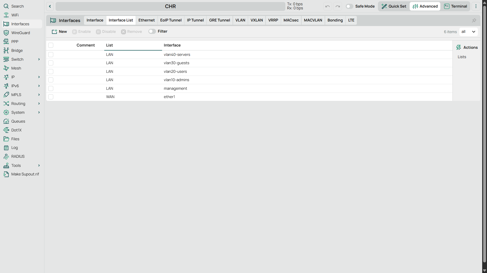

### DHCP Servers

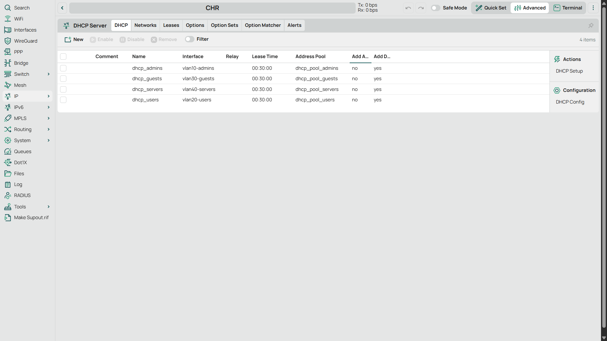

### DHCP Leases

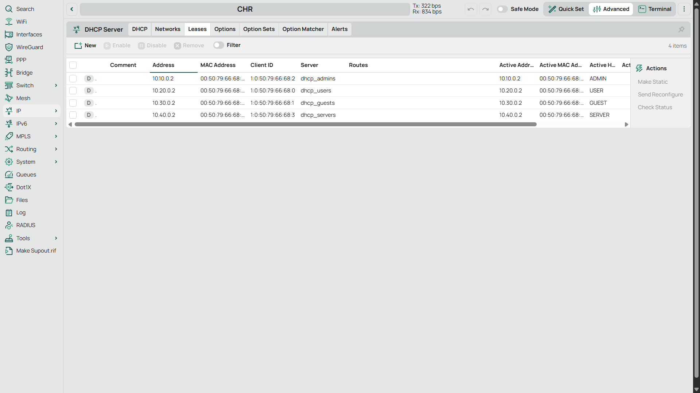

### DNS

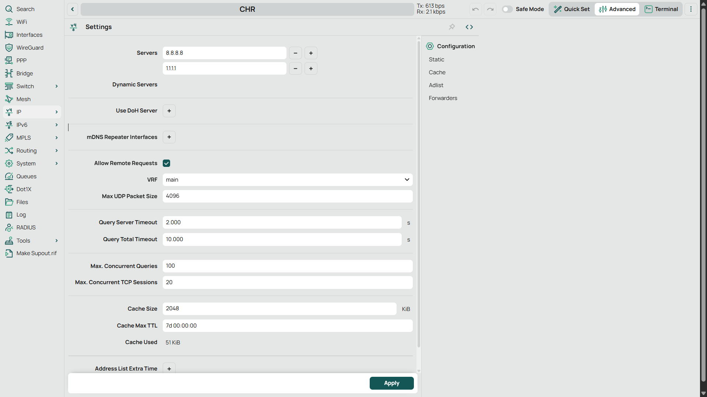

### NAT

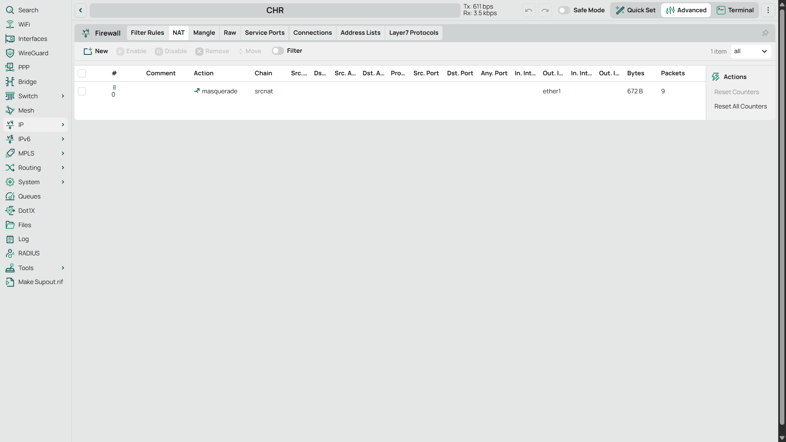

### Firewall Filter Rules

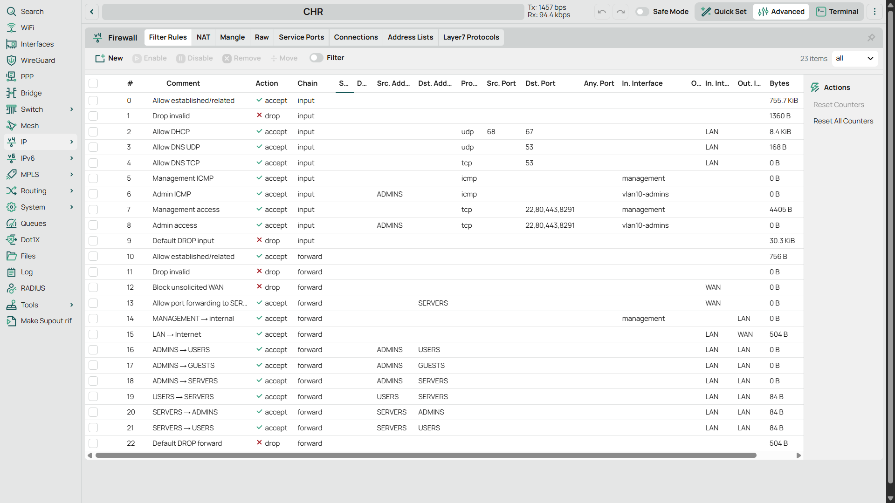

| Chain     | Policy (visible rules)                                                                                                                                                                                       |
| --------- | ------------------------------------------------------------------------------------------------------------------------------------------------------------------------------------------------------------ |
| `input`   | Accept established/related, drop invalid; allow DHCP and DNS from `LAN`; ICMP and management ports (`22,80,443,8291`) only from `management` and from `ADMINS` on `vlan10-admins`; default drop.             |
| `forward` | Accept established/related, drop invalid; drop unsolicited `WAN`; `LAN` → `WAN` allowed; inter-VLAN: `ADMINS` → `USERS`/`GUESTS`/`SERVERS`, `USERS` → `SERVERS`, `SERVERS` → `ADMINS`/`USERS`; default drop. |

### Backup Files

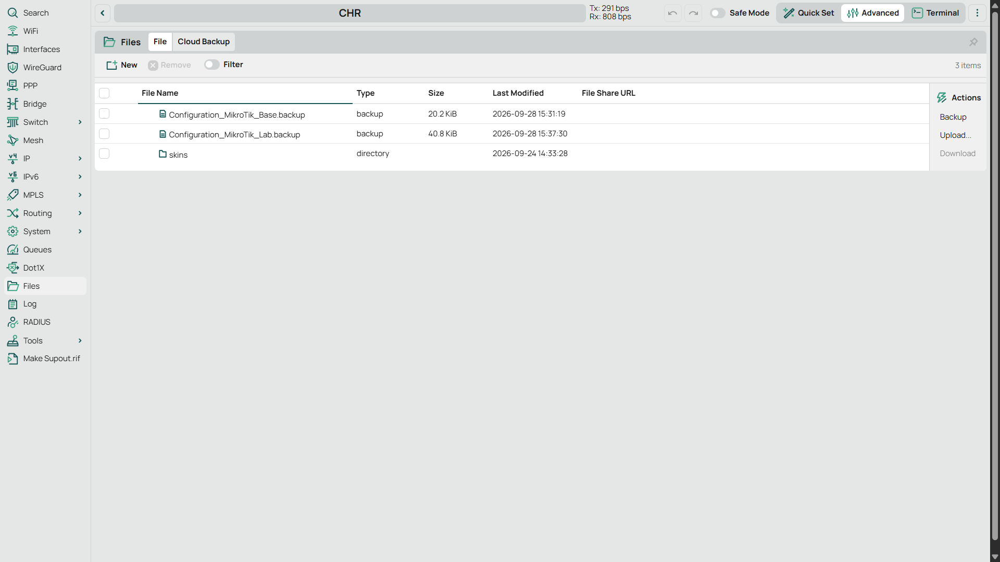

| File                                 | Contents                                                                                                            | Use it for                                                                                            |
| ------------------------------------ | ------------------------------------------------------------------------------------------------------------------- | ----------------------------------------------------------------------------------------------------- |
| `Configuration_MikroTik_Lab.backup`  | Fully preconfigured lab: VLAN interfaces, IP addressing, DHCP servers, DNS, NAT, interface lists and firewall rules | **Default.** Use this to get the finished lab running and to follow the connectivity tests.           |
| `Configuration_MikroTik_Base.backup` | Only the preconfigured `management` interface                                                                       | Your own experiments. Start from a clean router and build the VLANs, DHCP, NAT and firewall yourself. |

### Restore steps

1. Open the MikroTik in WebFig (`172.16.0.3`) and go to **Files**.
2. Select the file and click **Restore**. Confirm when asked. In older WebFig versions this is under **Files → Backup → Restore**.
3. Wait for the router to reboot, then reconnect via `172.16.0.3`.

### Network adapter configuration

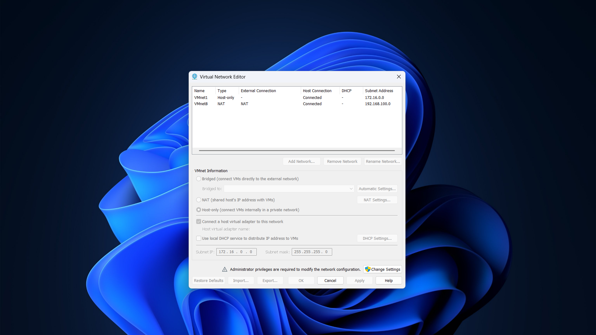

| VMware network | Type      | Subnet          | DHCP | Used for                                                                                                           |
| -------------- | --------- | --------------- | ---- | ------------------------------------------------------------------------------------------------------------------ |
| `VMnet1`       | Host-only | `172.16.0.0/24` | Off  | Management (MikroTik `management` = `172.16.0.3`; GNS3 console URLs point to `172.16.0.2`, apparently the GNS3 VM) |
| `VMnet8`       | NAT       | `192.168.100.0` | Off  | External access (MikroTik `ether1` = `192.168.100.3`)                                                              |

---

## Connectivity Tests

Single `ping -c 1` per destination. Green = reply, red = timeout.

| ADMIN                             | USER                                |
| --------------------------------- | ----------------------------------- |
| 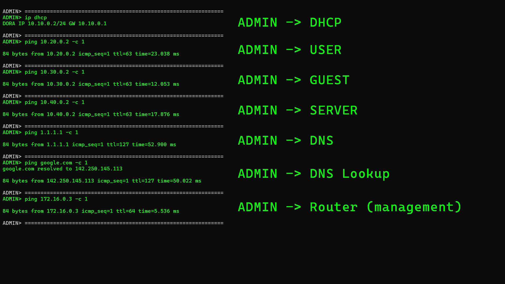 | 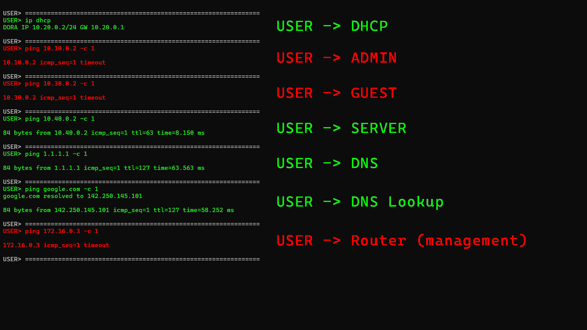     |
| **GUEST**                         | **SERVER**                          |
| 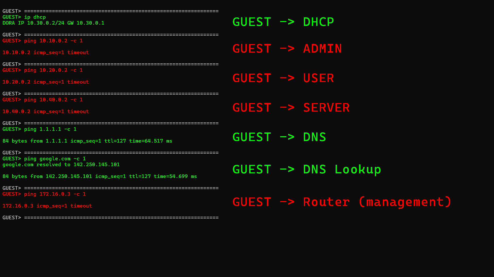 | 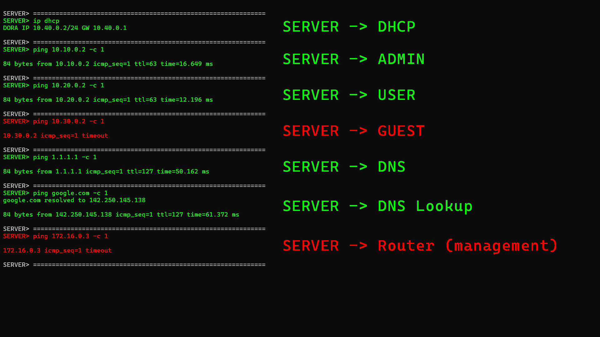 |

### Result matrix

| Source ↓ / Destination → | ADMIN | USER | GUEST | SERVER | Router `172.16.0.3` | Internet / DNS |
| ------------------------ | :---: | :--: | :---: | :----: | :-----------------: | :------------: |
| **ADMIN**                |   –   |  ✅  |  ✅   |   ✅   |         ✅          |       ✅       |
| **USER**                 |  ❌   |  –   |  ❌   |   ✅   |         ❌          |       ✅       |
| **GUEST**                |  ❌   |  ❌  |   –   |   ❌   |         ❌          |       ✅       |
| **SERVER**               |  ✅   |  ✅  |  ❌   |   –    |         ❌          |       ✅       |

This matches the firewall rules above. Reachability is directional (e.g. ADMIN → USER works, USER → ADMIN does not).

---

## Exam Relevance

Practice for VLANs, addressing, routing, DHCP, NAT, firewalling, troubleshooting and RouterOS as covered in INF.02 preparation. It is a learning environment, not necessarily an exact representation of current exam tasks.

---

## Author / Contact

- **Author:** Jakub Gawron
- **GitHub:** [github.com/JakubGawron](https://github.com/JakubGawron)
- **Repository:** [github.com/JakubGawron/mikrotik-lab-inf.02](https://github.com/JakubGawron/mikrotik-lab-inf.02)
- **Contact:** [contact.jakub.gawron@gmail.com](mailto:contact.jakub.gawron@gmail.com)
